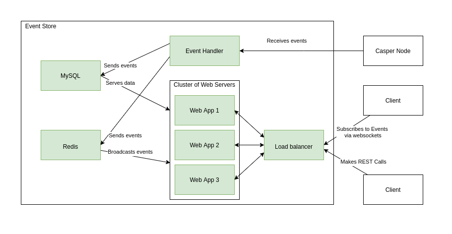

# Casper Event Store
## High Level View

## Event Fetcher
Event Fetcher is a program that is responsible for:
* Reading events from Casper Node. It requires constantly open HTTP connection.
* Retrying Casper Node connection if it drops.
* Parsing events and sending them to the Event Store using
  REST API. If Event Store is not available, events should be kept in the memory
  and handled later.

systemd should supervise the Event Fetcher and restart it if required.

## Event Store
Event Store is a standard web server. It offers:
* REST calls with filtering and pagination.
* WebSockets with subscriptions and filters.
* Horizontal scaling.

Supported models:
* Blocks
* Deploys
* Accounts

### Web App
Web App is written in [Express.js](https://expressjs.com/).

### Database
As a database we use MySQL. It can be easily set in the master-slave config,
so each instance of a Web App has its own read-only instance. Only the
instance, that populates data from the Event Fetcher needs write access.

Storage should be designed, so it doesn't store duplicated events.

For the sake of testing it should be possible to use in-memory db. 

### Horizontal Scaling
Scaling is done by having multiple instances of a Web App. Incoming traffic
is equally distributed among WebApps. To communicate with all the 
connected clients via websockets Redis is used as a PubSub mechanism.

## CI/CD
The code should be fully tested. Docker images should allow to
start:
* All-in-one instance for local testing and development. 
* Cluster mode for deployment.